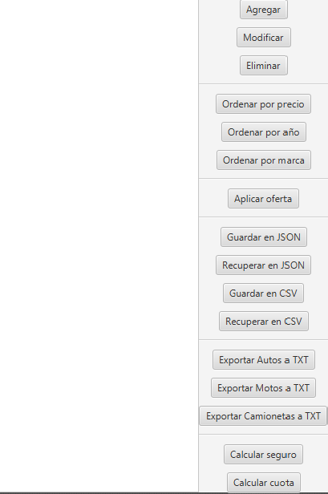
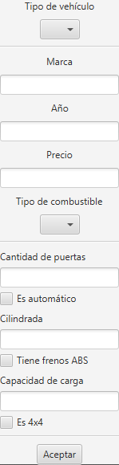
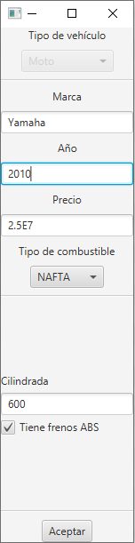
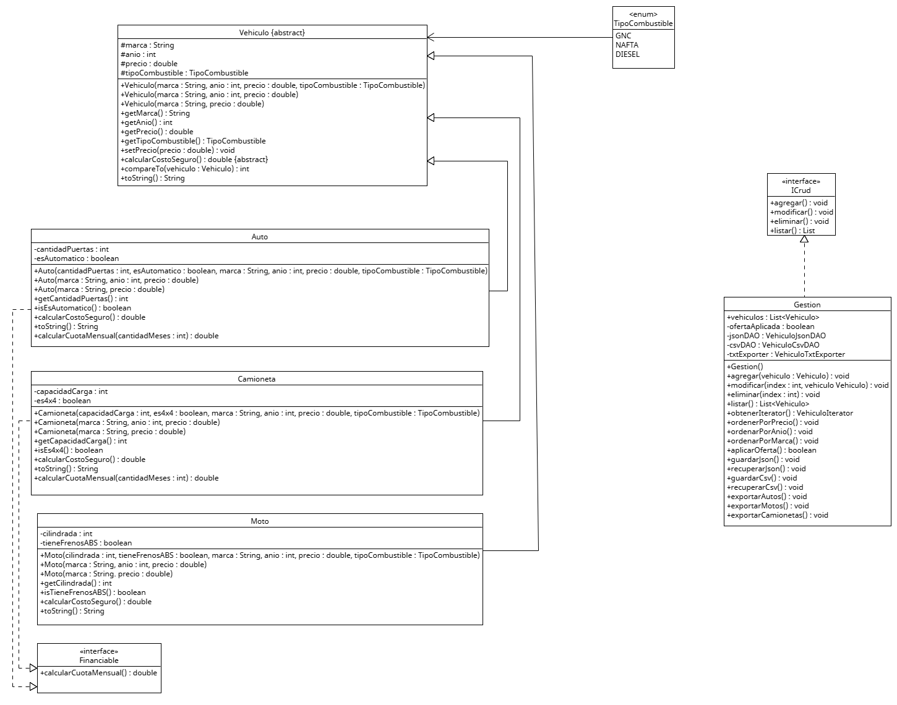

# 🚗 CRUD - Gestión de Vehículos

## 👤 Sobre mí

Mi nombre es Facundo Fiestas, soy estudiante y desarrollé esta aplicación como parte de un proyecto académico de Programación. En este trabajo se aplican conceptos de programación orientada a objetos, persistencia de datos y uso de JavaFX para la interfaz gráfica.

## 📋 Resumen

La aplicación **Gestión de Vehículos** es un sistema CRUD desarrollado en Java con JavaFX que permite administrar distintos tipos de vehículos: autos, motos y camionetas.

El usuario puede realizar las siguientes acciones:

- Agregar nuevos vehículos
- Modificar vehículos existentes
- Eliminar registros
- Visualizar la lista completa de vehículos
- Ordenar por distintos criterios (precio, marca y año)
- Aplicar descuentos globales
- Exportar información a archivos de texto
- Guardar y recuperar datos en formatos JSON y CSV

El sistema cuenta con una interfaz gráfica intuitiva que facilita la interacción del usuario, permitiendo gestionar la información de manera rápida y sencilla.

---

## 🖥️ Interfaz gráfica

### 📌 Vista principal

En esta pantalla se muestra el listado de vehículos junto con las principales acciones del sistema.

---

### ➕ Crear vehículo

Esta vista permite ingresar los datos necesarios para registrar un nuevo vehículo en el sistema.

---

### ✏️ Modificar vehículo

En esta pantalla el usuario puede actualizar la información de un vehículo existente.

## 📊 Diagrama de Clases UML

A continuación se presenta el diagrama de clases UML del sistema, donde se pueden observar las relaciones entre las distintas clases, incluyendo herencia, implementación de interfaces y asociaciones principales.

## 📁 Archivos generados

El sistema permite generar y utilizar distintos tipos de archivos para almacenar y exportar la información de los vehículos. A continuación se detallan los archivos utilizados junto con su funcionalidad:

### 📄 vehiculos.json

Archivo generado para guardar todos los vehículos en formato JSON.

- Permite persistir la información de manera estructurada.
- Puede ser recuperado posteriormente para restaurar el estado del sistema.

### 📄 vehiculos.csv

Archivo generado para guardar todos los vehículos en formato CSV.

- Permite persistir la información de manera estructurada.
- Puede ser recuperado posteriormente para restaurar el estado del sistema.

### 📄 autos.txt

- Archivo generado para guardar todos los "Autos" en txt.

- Permite visualizar los datos en formato tabular

### 📄 motos.txt

- Archivo generado para guardar todos los "Motos" en txt.

- Permite visualizar los datos en formato tabular

### 📄 camionetas.txt

- Archivo generado para guardar todos los "Camionetas" en txt.

- Permite visualizar los datos en formato tabular

